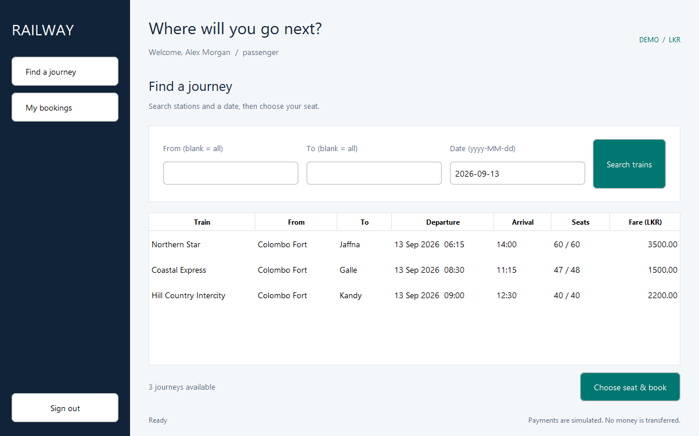
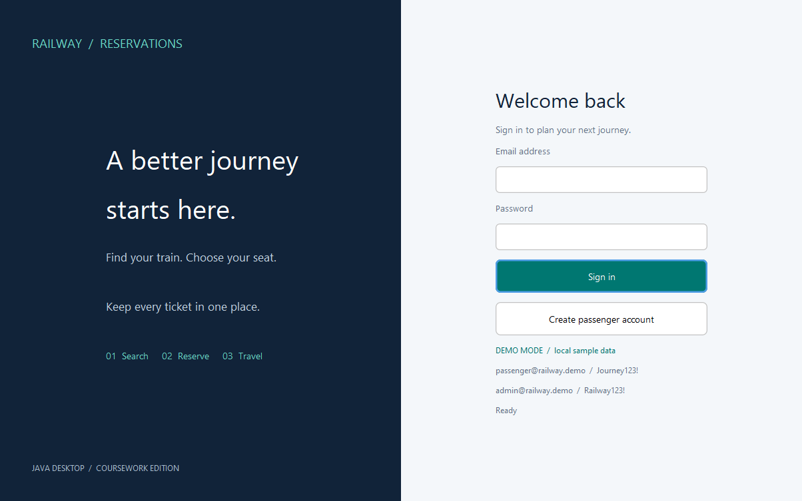
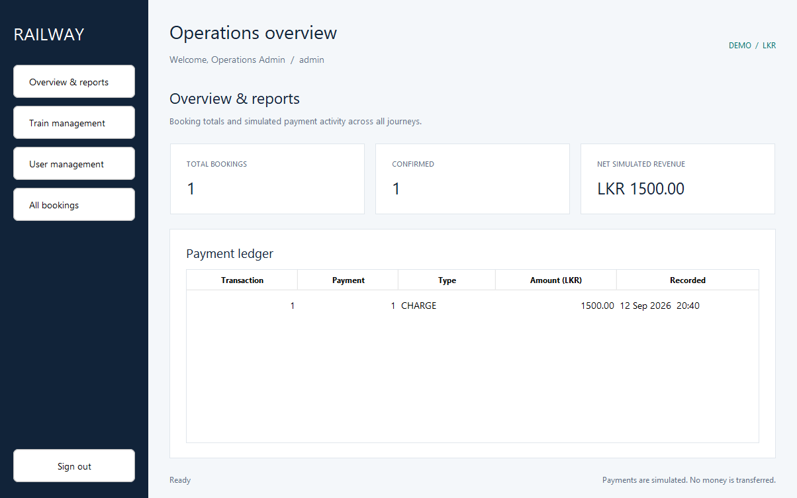
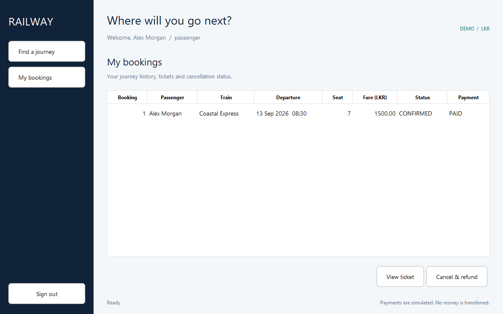

# Railway - Train Ticket Reservation System

A Java 17 Swing desktop application for OOP coursework and a software engineering portfolio. Passengers search departures, choose seats, simulate payment and manage tickets. Administrators manage trains, users, departures, bookings and reports.



## Features

- BCrypt registration/login and service-layer role permissions.
- Passenger and train CRUD with deactivation/retirement preserving history.
- Dated departures with per-schedule capacity, fare and seat availability.
- Transactional reservation, row locks and a unique seat allocation constraint.
- Card/cash payment polymorphism and deliberate decline simulation.
- Idempotent cancellation, released seats and a retained charge/refund ledger.
- Swing sidebar dashboards, seat map, tickets and admin reports.
- Background JDBC/password operations through SwingWorker.
- MySQL deployment and a separate H2 demo mode.

**Payments are simulated. No money moves or card information is collected. Tickets are not valid for travel.**

## Technologies

Java 17+, Maven, Swing, FlatLaf, MySQL 8.0.16+, JDBC, BCrypt, JUnit 5 and H2. Dependencies and plugins are pinned in `pom.xml` for reproducibility, not represented as the latest versions.

## Quick start

Install JDK 17+ and Maven 3.9+, then run from this project folder:

```sh
mvn clean verify
java -jar target/railway-reservations-1.0.0.jar --demo
```

The supplied release JAR needs only Java. Demo data is stored in `data/railway.mv.db` relative to the working folder. Use a writable folder.

The delivery ZIP includes `dist/railway-reservations-1.0.0.jar`. On Windows, double-click `start-demo.cmd`, or run `java -jar dist/railway-reservations-1.0.0.jar --demo`. The `dist/` folder is ignored by Git. Use the same JAR without `--demo` for MySQL after completing configuration below.

| Role | Demo email | Demo password |
|---|---|---|
| Admin | admin@railway.demo | Railway123! |
| Passenger | passenger@railway.demo | Journey123! |

Demo credentials apply only to `--demo`. The first launch seeds three trains and 14 days of departures starting tomorrow. Subsequent launches preserve data. Add future departures through the admin screen when sample dates expire, or use a new working folder for an independent demo database.

### NetBeans

1. Configure JDK 17+ under Tools > Java Platforms.
2. File > Open Project; select this folder containing `pom.xml`.
3. Clean and Build Project.
4. Set Run > Arguments to `--demo` in project properties, or run `mvn exec:java -Dexec.args="--demo"` from a terminal.
5. Main class: `com.railway.App`. The interface is handwritten Swing; no GUI-builder `.form` files are needed.

## MySQL setup

1. Start MySQL with InnoDB as the default storage engine. Edit the sample password in `database/setup.sql`.
2. Launch a MySQL administrator client **from this project folder** and execute:

```sql
SOURCE database/setup.sql;
```

This creates the `railway` schema, tables and a local application user with SELECT/INSERT/UPDATE/DELETE privileges. MySQL startup does not execute DDL; schema installation is an administrator task.

3. Copy `config/database.properties.example` to `config/database.properties` and enter your credentials. The sample URL requires TLS. For a remote server use `sslMode=VERIFY_IDENTITY` and configure trusted certificates. Environment variables `RAIL_DB_URL`, `RAIL_DB_USER`, `RAIL_DB_PASSWORD` override the file.
4. Create the first admin from an interactive terminal (password input is hidden):

```sh
java -jar target/railway-reservations-1.0.0.jar --bootstrap-admin
```

5. Start the app without `--demo`:

```sh
java -jar target/railway-reservations-1.0.0.jar
```

6. Admin > Train management > Add train > Add departure. Passengers register from the login screen. Fares use LKR and dates use the local railway timezone.

MySQL has no seeded login password. Bootstrap refuses a second administrator. Roles are immutable in this version.

## Project structure

```text
src/main/java/com/railway/
  App.java       composition root
  model/         immutable domain data and payment strategies
  controller/    background UI action execution
  service/       authentication, permissions and business transactions
  repository/    prepared JDBC operations and resource lifecycle
  database/      configuration, schema and demo seeding
  view/          Swing forms, tables, seat map and theme
  utils/         validation and safe exceptions
src/main/resources/schema.sql
src/test/java/com/railway/
database/setup.sql
config/database.properties.example
docs/            diagrams, report, tests, viva guide and screenshots
.github/workflows/build.yml
```

## OOP examples

| Concept | Implementation |
|---|---|
| Encapsulation | User has private final fields and no password property; services protect mutations. |
| Inheritance | Admin and Passenger extend abstract sealed User. |
| Polymorphism | User.dashboardTitle and Payment.authorize dispatch to subtype implementations. |
| Abstraction | User, Payment and JDBC callback contracts hide implementation details. |
| Classes/objects | Train, Schedule, Seat, Booking, Ticket and Transaction model application data. |
| Relationships | Schedule contains Train; booking/ticket relationships use IDs and database foreign keys. |

See [design decisions](docs/DESIGN.md), [class diagram](docs/ClassDiagram.png) and [database diagram](docs/DatabaseDiagram.png).

## Tests

```sh
mvn test
```

The default suite uses fresh H2 databases through real JDBC. It checks authentication, role permissions, CRUD, SQL injection attempts, payment rollback, competing seat bookings, refunds and departed journeys. H2 compatibility mode does not prove MySQL equivalence.

The same suite accepts `RAIL_TEST_DB_URL`, `RAIL_TEST_DB_USER`, `RAIL_TEST_DB_PASSWORD` for a **disposable MySQL database named `railway_test`**. It creates tables and deletes test records before every test. Other schema names are rejected. Never use application data. The supplied GitHub workflow runs both H2 and MySQL 8.4. See [test evidence](docs/TESTING.md) for what was actually executed locally.

## Screenshots and coursework

Screenshots render actual Swing components populated by real services and temporary demo data.





- [Project report PDF](docs/ProjectReport.pdf) and [editable text](docs/ProjectReport.md)
- [Design explanation](docs/DESIGN.md)
- [Viva guide](docs/VIVA.md)
- [GitHub preparation](docs/GITHUB.md)

## Limitations and future improvements

This is a trusted-workstation coursework application. A distributed desktop client with shared DB credentials cannot act as a secure public service boundary. Use an authenticated backend API before exposing it to untrusted clients.

Future work: real payment gateway and reconciliation; API-side MFA/rate limiting/password recovery; multiple passengers per booking; intermediate stops and segment occupancy; schedule changes with notification; optional Ticket Officer; pagination, pooling and migrations; accessibility review; multiple currencies/timezones. Existing booked train details and all published schedules are intentionally immutable. Ticket Officer is omitted as optional scope.

## References

- [MySQL Connector/J Maven installation](https://dev.mysql.com/doc/connector-j/en/connector-j-installing-maven.html)
- [H2 compatibility modes](https://h2database.com/html/features.html)
- [Maven Surefire documentation](https://maven.apache.org/surefire/maven-surefire-plugin/)

Understand and adapt the implementation and report in your own words. Follow your institution's requirements for acknowledging assistance before submission.
