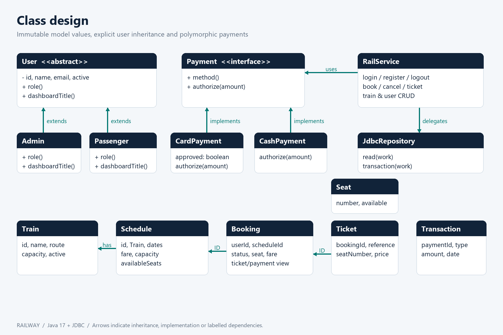
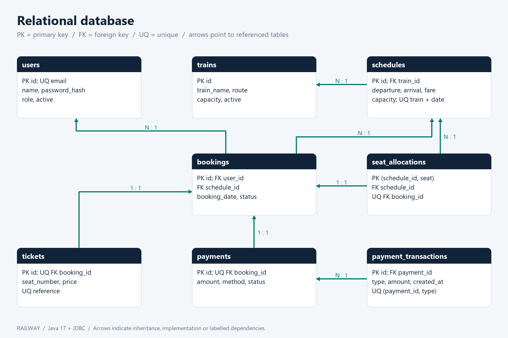

# Train Ticket Reservation System

Coursework project report

## 1. Introduction

Railway is a standalone Java desktop Train Ticket Reservation System developed as an Object-Oriented Programming coursework and portfolio foundation. It models the passenger journey from account creation to train search, seat selection, simulated payment, ticket history and cancellation. Administrators operate the fleet, publish departures, maintain passenger accounts and inspect booking/payment activity.

The objective is to demonstrate useful object-oriented design together with reliable data handling. The project uses Java 17, Swing, JDBC and MySQL, organized around MVC responsibilities. A separate H2 demo mode makes local evaluation possible without provisioning a server. This report describes the delivered implementation rather than a proposed system.

### Scope

The application supports Admin and Passenger roles, one seat per booking, direct origin-to-destination journeys, LKR fares and a single local timezone. Card and cash payments are clearly labelled simulations; no payment credentials are accepted. Ticket Officer is optional in the brief and is not implemented.

### Learning outcomes

The code demonstrates encapsulation, abstract classes, inheritance, interface-based polymorphism, immutable values, object relationships, CRUD, prepared SQL, transactions, exception handling, asynchronous GUI actions, testing and documentation. The viva guide supplies a source-reading order and a short demonstration script.

## 2. Problem Identification and Analysis

A reservation system must coordinate scarce seats across users while keeping tickets and payments consistent. A basic CRUD interface cannot alone guarantee that two users do not book the same seat, that a failed payment releases capacity, or that one passenger cannot cancel another passenger's booking.

Storing a single availability count on a train would mix journeys on different dates. Deleting user or train records would also break historical relationships. The design therefore separates fleet metadata, dated schedules, historical bookings and current seat allocations.

### 3. Requirements Analysis

Area | Delivered requirement

Authentication | Passenger registration, BCrypt login, logout and role checks

Passenger | Date/station search, seat choice, simulated payment, ticket history and cancellation

Admin | Train/user CRUD, departure creation, all bookings and payment reports

Integrity | Foreign keys, uniqueness, locking, rollback and idempotent refunds

Quality | MVC packages, immutable models, background workers, tests and documentation

Non-functional goals include a responsive desktop interface, readable source, safe error messages, repeatable tests and protected database credentials. The MySQL runtime user receives data access privileges without schema-administration rights. The interface must show that payments and tickets are coursework simulations.

## 4. System Design

App is the composition root. MainFrame and Theme render Swing components. AppController executes work in SwingWorker and delivers results on the event-dispatch thread. RailService owns authentication, permissions and use cases. JdbcRepository binds parameters, runs connection-scoped callbacks and handles transactions. Database reads configuration and opens connections.

Layer | Responsibility

View | Input, forms, tables, seat map and feedback

Controller | Background work and UI completion/error handling

Service | Business rules, authorization and transaction boundaries

Repository/database | Prepared JDBC, resource cleanup and connection settings

Model | Identity, train/schedule values, tickets and payment contracts

A page generation number stops an old asynchronous result from rendering into a new page after navigation. Business rules remain in the service so a hidden admin button is not the only permission boundary. Tests inject a repository and clock without starting the GUI.

### Booking transaction

The service requires an active passenger, locks the train then schedule, validates seat and departure, inserts booking/ticket/allocation, invokes Payment.authorize and records payment/charge before commit. Any failure rolls back all records. The database also enforces a unique schedule-seat key. The coarse train lock intentionally favors understandable correctness over high-throughput scheduling.

## 5. Class Diagram

Admin and Passenger extend abstract User. The view invokes dashboardTitle through User, demonstrating dynamic dispatch. CardPayment and CashPayment implement the sealed Payment interface; booking invokes authorize through that contract. Schedule contains a Train. Booking is a read model combining related ticket, schedule and payment data for the view.

Domain values are immutable. The traditional User class uses private final fields, while Java records concisely model Train, Schedule, Seat, Ticket, Booking and Transaction. RailService depends on JdbcRepository. Stored relationships are represented with stable IDs and enforced with foreign keys; the diagram highlights the central dependencies rather than every UI method.

## 6. Database Design

The schema contains users, trains, schedules, bookings, tickets, seat_allocations, payments and payment_transactions. application_locks is a separate one-row infrastructure table used to serialize first-admin bootstrap. It is omitted from the business relationship diagram.

Available seats are derived from schedule capacity minus allocations. Cancellation retains booking/ticket/payment history and removes only active occupancy. Unique ticket/payment booking keys enforce one per booking; a unique payment/type pair prevents duplicate refund entries. Schedule capacity is a snapshot, and booked train details cannot be edited. Monetary values use DECIMAL(10,2).

## 7. OOP Concepts Used

Concept | Application example

Encapsulation | User state is private/final; password hashes are not exposed in User.

Inheritance | Admin and Passenger share identity through User.

Polymorphism | dashboardTitle and Payment.authorize dispatch through abstract types.

Abstraction | User, Payment and JDBC callback contracts hide implementation details.

Classes/objects | Train, Schedule, Ticket, Booking, Seat and Transaction model the domain.

Relationships | Schedule contains Train; IDs link bookings, tickets and payments.

Sealed types express the deliberately limited role and payment variants. Records prevent accidental mutation after a query returns. Composition is used for services and repositories instead of inheriting from a generic framework base class. This keeps the design small enough to explain during a viva.

### Why the abstractions matter

Payment polymorphism is used by a real business operation rather than included only for a diagram. The card simulation can decline, causing rollback; cash simulation approves a positive amount. The booking service does not branch on implementation type. User polymorphism likewise changes the dashboard heading through the shared type.

## 8. Implementation Details

New passwords use BCrypt cost 12 with a minimum of 10 characters and a maximum of 72 UTF-8 bytes. Character arrays are cleared after processing; the BCrypt library still requires a Java String that cannot be erased deterministically. Email addresses are normalized. Registration always creates a passenger; admin bootstrap is an explicit terminal operation and rejects a second admin.

Service-issued sessions are retained in memory and removed on logout. Each protected call re-reads the user and active state. Passenger booking lists are filtered by owner. Ticket and cancellation access also checks ownership. Prepared statements bind all user-controlled values. Connection, statement and result lifetimes use try-with-resources.

Cancellation locks the schedule and booking, checks departure and ownership, updates status, releases allocation and writes a full simulated refund atomically. A second cancellation does nothing. Retiring a train with future confirmed reservations is rejected. Deactivating a user preserves historic bookings; administrator deactivation is blocked.

### UI workflow

The split login page provides clear account actions. Sidebar navigation separates passenger search/history and administrative management/reports. Search results show route, time, capacity and fare. Seat buttons show unavailable positions, and payment choices explicitly identify simulation. Database work and password hashing run outside the Swing event-dispatch thread.

### Security boundary

This application assumes a trusted workstation. Shared JDBC credentials cannot be hidden securely from a modified desktop client. A public deployment needs an authenticated server API, rate limiting and identity recovery. Real payments require a separate state machine and reconciliation rather than an external gateway call while holding database locks.

## 9. Testing

The delivered service test suite contains 21 tests executed through actual JDBC with isolated H2 databases. All 21 passed with zero failures, errors or skipped tests during local validation. Java 23 compiled the source with --release 17. The Maven project and CI target Java 17; the local machine did not have a Java 17 runtime or MySQL server.

Test group | Examples

Identity | Correct/incorrect login, hashing, normalization, duplicate email

Permissions | Role denial, logout, deactivated session, cross-account privacy

CRUD | Train/user changes, retirement and history protection

Reservations | Successful booking, seat bounds, duplicates and two-thread contention

Payments | Decline rollback, charge/refund balance and cancellation idempotency

Validation | Injection payloads, schedules, money and departed journeys

The concurrency test starts two workers competing for the same seat and requires exactly one success, one allocation and one booking. The decline test checks that no booking, ticket, payment, transaction or allocation survives rollback. A future clock verifies booking and cancellation rejection after departure.

The same suite can target an isolated MySQL schema named railway_test. A GitHub Actions workflow provisions MySQL 8.4 and runs it after the H2 suite. MySQL CI and manual user-acceptance scenarios are supplied, not claimed as executed locally. See TESTING.md and machine-readable test evidence for exact results.

## 10. Conclusion

The project goes beyond independent CRUD forms by connecting account permissions, dated seat inventory, transactions, payment behavior and preserved booking history. Its OOP examples are used in working flows, and its separation of concerns allows backend behavior to be tested independently from Swing.

The implementation is suitable as a coursework foundation and portfolio demonstration when its limitations are presented honestly. Students should review the source, adapt the report with their own reasoning and follow institutional rules on acknowledging assistance. The included viva guide helps explain decisions but does not replace understanding the code.

### 11. Future Improvements

Priorities for a public system are an authenticated backend API, managed identity with recovery/MFA and rate limiting, and a real payment integration with idempotency and reconciliation. Operational improvements include schema migrations, connection pooling, paginated reports and audit events.

Product extensions include multiple seats/passengers per booking, intermediate stops with segment-level occupancy, schedule editing with notification, ticket-officer verification and ticket export. Accessibility review, configurable currencies/timezones and larger-data performance tests would strengthen the desktop experience.

### Reference documentation

MySQL Connector/J: https://dev.mysql.com/doc/connector-j/en/connector-j-installing-maven.html

H2 features and compatibility: https://h2database.com/html/features.html

Maven Surefire: https://maven.apache.org/surefire/maven-surefire-plugin/
